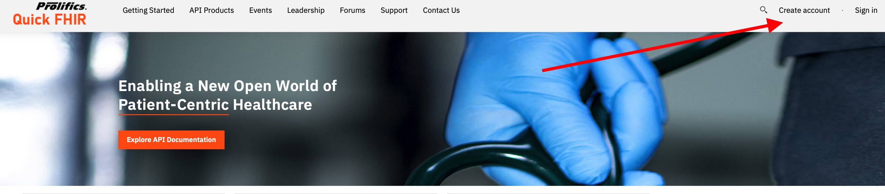

# Quick FHIR

Quick FHIR provides a powerful API gateway and developer portal for developing, publishing, securing and socializing FHIR-based APIs - either for exposing FHIR compliant systems or for integrating with non-FHIR compliant systems.

Follow the steps below to experience a guided walk-through of the developer portal.

## Register

1. Open https://www-apicdevpus.ad.prolifics.com/2966/quick-fhir/ in your browser.

2. Click on the **Create account** link.

3. Fill out the following details
* Username
* Email address
* First Name
* Last Name
* Consumer organization
* Password

4. Click on **Sign up**

5. You will receive an activation email to the email address you specified. Click on the link in the email.

6. Your user is now activated! You will be able to sign in with this user using the **Sign in** link

## Explore the API Products

1. Click on the **API Products** link.

2. You'll then see the following API products listed.

* **Cloudant FHIR Database** : Provides a sample of 18 FHIR APIs with a Cloudant database back-end to allow you to test applications that require FHIR endpoints for those APIs.
* **Consent Guarded Cloudant FHIR Database** : Same as above, but specifically for third parties that require access to the same APIs, but that require consent from the data owners before they are able to access their data.
* **Consent** : API for allowing data owners to provide consent to third parties allowing them to access their data.
* **IBM FHIR Server** : Provides a sample of 18 FHIR APIs with an IBM FHIR server back-end that allows testing where validation of the messages is important.

## Explore the APIs
...

## Create your Application
...

## Subscribe to an API Product
...

## Try an API!
...

## Learn More
...
